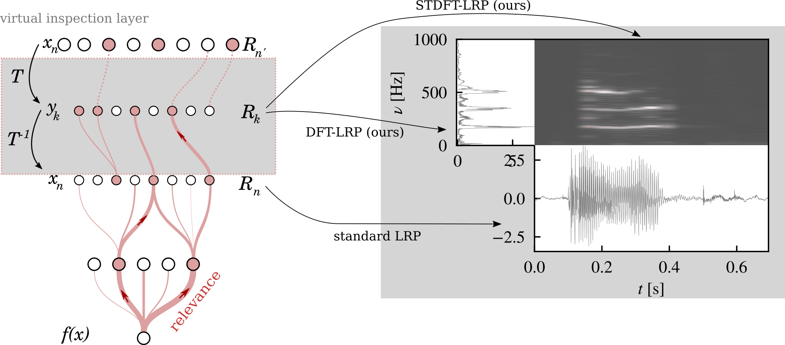

# DFT-LRP

This repository provides an implementation of DFT-LRP, which applies Layerwise Relevance Propagation to the Discrete Fourier Transform, and is introduced in [Explainable AI for Time Series via Virtual Inspection Layers](https://arxiv.org/abs/2303.06365). For a time series model trained on the signal representation in time domain, DFT-LRP enables inspection of feature importance attributions not only in the time, but also in frequency and time-frequency domain, which might be more interpretable depending on the signal.

If you find this repository useful, please cite our paper:

Johanna Vielhaben, Sebastian Lapuschkin, Grégoire Montavon, Wojciech Samek: [Explainable AI for Time Series via Virtual Inspection Layers](https://arxiv.org/abs/2303.06365)

    @misc{vielhaben2023explainable,
        title={Explainable AI for Time Series via Virtual Inspection Layers}, 
        author={Johanna Vielhaben and Sebastian Lapuschkin and Grégoire Montavon and Wojciech Samek},
        year={2023},
        eprint={2303.06365},
        archivePrefix={arXiv},
        primaryClass={cs.LG}
    }