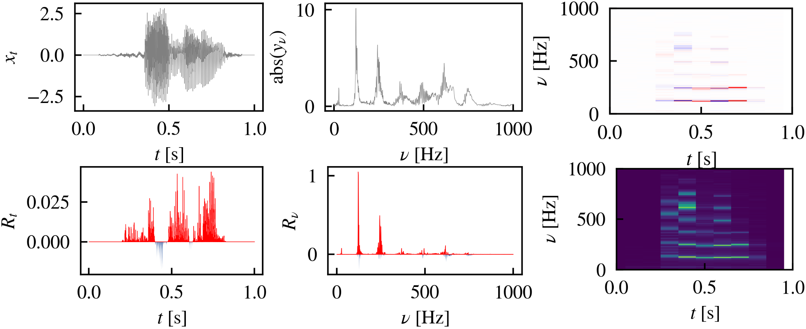

# XAI for audio with DFT-LRP

DFT-LRP applies Layerwise Relevance Propagation to the Discrete Fourier Transform, and is introduced in [Explainable AI for Time Series via Virtual Inspection Layers](https://arxiv.org/abs/2303.06365). For a model trained on the signal representation in time domain, DFT-LRP enables inspection of feature importance attributions not only in the time, but also in frequency and time-frequency domain, and vice versa. For audio models, visual explanations are often more interpretable in the spectrum and spectrogram representation, while audible explanations can only be provided in the waveform representation. DFT-LRP enables all of these explanations, regardless on the input representation of the model.

# Audible explanations

[AudioMNIST: Exploring Explainable Artificial Intelligence for Audio Analysis on a Simple Benchmark](https://arxiv.org/abs/1807.03418) introduces audible LRP explanations and demonstrates their superior interpretability over visual ones in the waveform representation.

For audible explanations, play 

$\text{ReLu}(x) \odot R$

### Local explanations
Explanations for an audio digit classifier's prediction 'six':

Correct prediction:

<audio src="assets/audible_lrp/class-6_pred-6_sample-5169_sample_10_heatmapxsignal.mp3" controls></audio>

Incorrect prediction, true label 'three':

<audio src="assets/audible_lrp/class-6_pred-3_sample-3562_sample_10_heatmapxsignal.mp3" controls></audio>

### Glocal explanations - audible neurons
Using [CRP explanations](https://www.nature.com/articles/s42256-023-00711-8), we can make single neurons audible. For an audio digit classifier, this can answer the question *'What are the neural building blocks of the model reasoning for 'nine'?'*

The two on average most relevant neurons for the prediction 'nine' are:

The 'i' also in 'five':

<audio src="assets/audible_crp/explanation_for-9_channel-0-125_prototype-0_from-5.wav" controls></audio>

The 'nni':

<audio src="assets/audible_crp/explanation_for-9_channel-1-42_prototype-0_from-1.wav" controls></audio>

# Visual explanations
Time, time-frequency, and frequency signal (first row) and relevances (second row)​  for an audio digit classifier. The signal corresponds to a spoken​ seven. In the time domain relevance tends to be distributed uniformly over the signal but is more localized in frequency and time-frequency domain.​

